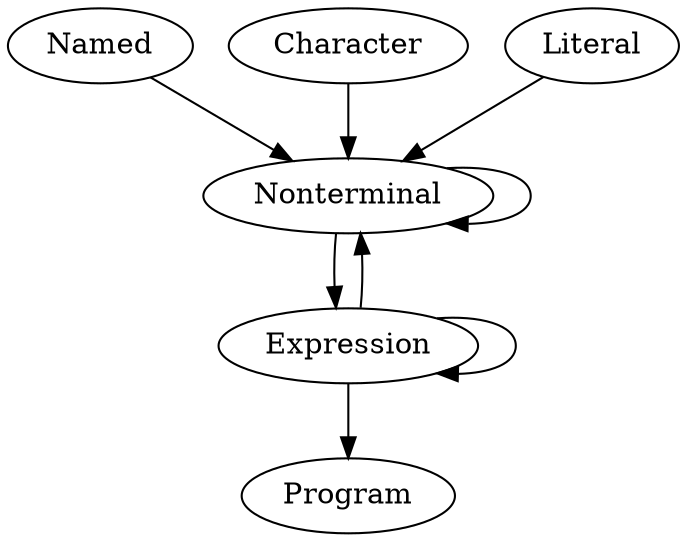
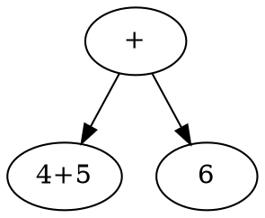
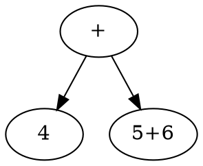

# Getting Started With Jison

Naturally, as I learn more about computer science, I would need to learn more computer languages; and using [jison][1] to build some basic calculator or compiler would be a great way to get my feet wet in the world of programming languages. This journal entry will be my first foray into building a compiler that translates a language into javascript. 

The ultimate goal of this project would be the creation of a ML-enabled meta-compiler that puts together to-js application-specific compilers. The code for this lives [here](../ailang)

## Introduction to Backus-Naur Form

Backus-Naur form is a meta-language for describing grammars using regular expressions as per [this video][6]. Reading the [wiki page][8] and the [extended wiki][7], I'm noticing that BNF resembles a *lot* what a typed language (e.g. haskell) looks like. Perhaps it's not a surprise that the "ML" part of "ocaml" stands for "meta-language"

Consider the following diagram (written in [dot][9]):



- Tokens eventually become numbers by the parser / language
- Philosophically, tokens are "meaningful" clusterings of input (both data and program) that allow for "emergence" of higher level behaviors from lower level simpler parts
- At the end of the day, the parser outputs 1 expression that leads to 1 action when executed (with possible additional input). This is what we ultimately call a "program"
- Expressions may perform "actions" (what I frequently think of as IO), this is where the language interfaces with the "substrate" that it lives on and affects the underlying physical media
  - For example, if someone tells me to "raise your hand", the program in my brain lexes, parses, then executes the input and generates motor signals that target the phyiscal "substrate" that is muscles in my arm to pull / relax in such an order that the end result is I raise my hand

Let's move onto using Bison to generate grammars

## Introduction to Bison

From the [bison docs][3]:

- Named Tokens
  - Operator-like things with names
  - See [calculator example][10]
- Character Tokens
- String Literal Tokens

However, with further reading, it seems the above are more "conventions" than actual bison syntax; instead, bison gives the following methods for declaring tokens in their [declaration summary][11]:

- `%token`
- `%union`
- ... others

Consider the `%token` "function type"

```reasonml
type token = {
  name: string,
  representation: string
}
```

For example, we have:

```bison
%token ARROW "=>"
%token  <operator>  OR      "||"
%token  <operator>  LTE 134  "<="
%left  OR  "<="
```

the `<operator>` specifies type of token - whatever that means - see [here][12]

### The Deal with Operator Precedence

We have 3 types of precedence to deal with in-fixing of operators and nesting

- `%left`
- `%right`
- `%nonassoc` 

Using their example [here][13], say we have the following:

```bison
%left PLUS "+" 
```
And the expression "4+5+6", we would get:



Whereas if we had `%right PLUS "+"`, the association would go "the other way"



If we use `%nonassoc PLUS "+"`, then we would get a syntax error

>Note: the later the declaration, the higher the precedence

### The Deal with Unions

These things are apparently a way to declare additional "types" - whatever those are. Read more about unions and types on [their site here][15]. I'm not going to go into details on that stuff here because it doesn't seem like I'll need it (especially after viewing examples)

## Usage Example In Real LIfe

- A much more illustrative example, check out the grammar for [javascript][14]
- [Coffeescript grammar][15]
  - Note that coffeescript implements their own [lexer][16] instead of using jison's
  - This is because they presumably want to handle space and indentation better

Here are some of my takeaways

- `%start` is a program's entry point, ever grammar requires one
- it's the lexer's job to "lex" the input string into consumable tokens for the parser, this is why we see a lot of things like `POST_IF`, `IF`, `ELSE`, and other random floating strings in the grammar syntax without references to "if" and stuff - this is because all the lexing was done ahead of time!
  - This means that whatever I declare under the `token` section, I should respect in my lexer!

First things first, I want to get a "hello world" example going by setting up my local environment to be able to work. Following the directions on the [jison github landing page][4], I will attempt to follow along with the [calculator example][5]

## On Jison Paramters

The parser is essentially a glorified series of function calls, and it seems here are its parameters:

```typescript
type action = (yytext, yyleng, yylineno, yy, yystate, $$, _$) => any
```

So what's the deal with all the "yy" stuff? read about it [here][18]

# References

As usual, see this page in raw to view my bibliography

[1]: <https://zaa.ch/jison/docs/> "Jison Landing Page"
[2]: <http://dinosaur.compilertools.net/bison/bison_4.html#SEC7> "Bison Concepts"
[3]: <http://dinosaur.compilertools.net/bison/bison_6.html#SEC34> "Bison Grammar Files"
[4]: <https://github.com/zaach/jison> "Jison Github Page"
[5]: <https://github.com/zaach/jison/blob/master/examples/calculator.jison> "Jison Calculator Example Grammar"
[6]: <https://www.youtube.com/watch?v=U7X6tDYwmdM> "Introduction to BNF"
[7]: <https://en.wikipedia.org/wiki/Extended_Backus%E2%80%93Naur_form> "Extended BNF"
[8]: <https://en.wikipedia.org/wiki/Backus%E2%80%93Naur_form> "BNF"
[9]: <https://en.wikipedia.org/wiki/DOT_(graph_description_language)> "Dot Language for Graph Visualization"
[10]: <https://github.com/zaach/jison/blob/bcf986e180359aa2404b1b73ecbfef1df4c6b011/examples/calculator.jison#L28-L33> "Operator Named Token Example"
[11]: <http://dinosaur.compilertools.net/bison/bison_6.html#SEC57> "Bison Declaration Summary"
[12]: <http://dinosaur.compilertools.net/bison/bison_6.html#SEC45> "Tokens with more than 1 type"
[13]: <http://dinosaur.compilertools.net/bison/bison_6.html#SEC51> "On operator precedence"
[14]: <https://github.com/zaach/jison/blob/master/examples/jscore.jison> "Js Core Jison Example"
[15]: <http://dinosaur.compilertools.net/bison/bison_6.html#SEC52> "Collection Values and Unions in Bison"
[16]: <https://coffeescript.org/v1/annotated-source/grammar.html> "Grammar of Coffeescript"
[17]: <https://coffeescript.org/v1/annotated-source/lexer.html> "Coffeescript Lexer"
[18]: <http://zaa.ch/jison/docs/#sharing-scope> "Sharing scope aka all the yy stuff"
