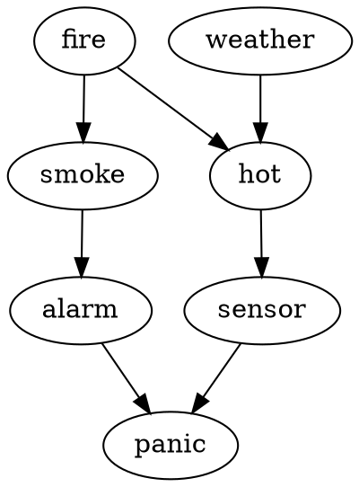

# Introduction to Graphical Probabilistic Models

After the rather blind foray into machine learning by first trying to use alchemy in my [previous journal entry](./3-using-alchemy.md), I now have a list of things I know I don't know:

- Q: What are "groundings"
- Q: How do MLNs relate to Markov Random Fields?
- Q: How do MRFs relate to Bayesian networks?
- Q: What about other Markov models?

The purpose of this journal entry is to attempt to understand what these things are by attempting to implement them all on my own / going through documentation.

See [here](../intgraph)

## Definitions by Example

I'd like to have examples of the following:

- [Factor graph][10]
- Markov Random Field
- Bayesian Network
- Belief propagation
- Potential function
- Evidence
- Query
- Inference
- [Joint probability][12]

Say I have the usual graphical model (which is known as a [Bayesian network][11]):



A "query" might be something like what is the probability of fire given the observed "evidence" of panic?

```math
P(fire | panic) 
```

Answering such a question is called probabilistic "inference" 

So... how do I calculate the query using my network? Apparently, the trick is to use probability tables and applications of Bayes's Rule

For example, our "prior beliefs" about fire might be following:

| fire = t | fire = f |
|---------|---------|
| 0.2     |  0.8    |

Panic:
|            |            | panic = t | panic = f |
|------------|------------|-----------|-----------|
| alarm = t  | sensor = t |     0.9   |      0.1  |
| alarm = t  | sensor = f |     0.8   |      0.2  |
| alarm = f  | sensor = t |     0.7   |      0.3  |
| alarm = f  | sensor = f |     0.1   |      0.9  |

Notice that because $panic\isin{t, f}$, as in we are either panicking or not panicking, every row always sums to 1 (otherwise, we would have an inconsistent probability table). 

An important point is to note that, in the beginning, my panic table *is still* my priors despite it having dependencies. Theoretically, I could get this information through performing empirical tests of how much I panic / stay calm when my alarms and sensors are on / off.

In any case, we would have such a similar table for node (aka vertex) in our network.

Okay... but how do exactly perform this "inference" for our query:

```math
P(fire=true | panic=true)
```

There are many different methods; the most elementary one is the so-called "variable elimination". It works thusly:

- Let:
  - F = fire
  - W = weather
  - S = smoke
  - H = hot
  - Se = sensor
  - A = alarm
  - P = panic
- Let: lowercase be shorthand for `*=t`
We start from the definition of condition probability

```math
P(f|p) = P(f,p) / P(p)
```

>protip: apparently, in the discrete world, the comma `","` denoting joint probability can be treated as something of a set union (aka logical junction)

TODO: next, use the average rule to sum over the "joint probability distribution" to calculate the exact value

# Appendix

## A1 - Feynman on the Process of Learning

Firefox recently recommended [this article][1] on "learning" where the author explains "Feynman's Technique" on learning. Paraphrasing, it is:

- "Demystify": filter and cluster new data in my own brain
- "Simplify": reduce size of new clusters as much as possible
- "Teach to a child": or alternatively a computer; the idea here is to faithfully "replicate" the newly learned meme in another brain such that they can repeat the process

There seems to be some sort of odd parallel here between Feynman's learning technique and the reproductive cycle of memes (and species, I suppose)

## A2 - Setting up a Python Project

I'm currently trying to use [pipenv][2] and [python-project-template][3] to get up and running, however, am currently running into trouble getting [paver][4] to run. Will need to diagnose. Glancing at their website, paver functionality seems to be super-ceded by pipenv - likely I will need TODO:

- [ ] bake in another testing framework
- [ ] remove paver

## A3 - Unrelated Notes on Judea Pearl's Book of Why

[Judea Pearl's Book of Why][6] (and accompanying [PDF][9]) discusses something totally new for me: a graphical model for causality that he calls "do-calculus". I have no idea what this thing is, so I will need to do a future journal entry that goes into further details. I think it'll serve me well to go through the [causal model][7] stuff on Stanford Plato

An interesting side-note on Judea Pearl, according to his [wiki page][8], apparently he also popularized / invented the Bayesian Network - quite an accomplished fellow!

## A4 - Why I Stopped Reading Joe Dispenza's Evolving Your Brain

[Joe Dispenza's Evolving Your Brain][5] is hard to slog through for the following reasons:

- focus on mysticism
- constantly reinforces the reader with snake-oil mantras
  - "You have the power"
  - "You are a miracle"
  - "You ..."
  - Stop trying to get me to "feel"
- lack of focus on objective facts or theories
- Uses the Copenhagen interpretation of quantum mechanics as a justification for the primacy of consciousness
  - Clearly obsessed with duality despite the fact he decries it upfront

# References

[1]: <https://getpocket.com/explore/item/the-secret-algorithm-behind-learning> "The Secret PseudoCode Behind Learning"
[2]: <https://github.com/pypa/pipenv> "Pipenv - package manager for python"
[3]: <https://github.com/seanfisk/python-project-template> "Python Project Template"
[4]: <https://github.com/paver/paver> "Python Paver"
[5]: <https://www.audible.com/pd/Evolve-Your-Brain-Audiobook/B01NANC6PV> "Evolve Your Brain on Audible"
[6]: <https://www.audible.com/pd/The-Book-of-Why-Audiobook/B07CYGJDJ8> "Book of Why on Audible"
[7]: <https://plato.stanford.edu/entries/causal-models/index.html> "Causal Models from Stanford Philosophy"
[8]: <https://en.wikipedia.org/wiki/Judea_Pearl> "Judea Pearl on Wikipedia"
[9]: <http://download.audible.com/product_related_docs/BK_BRLL_010665.pdf> "Accompanying PDF to the Book of Why on Audible"
[10]: <http://deepdive.stanford.edu/inference> "Stanford Deepdive on Factor Graphs"
[11]: <https://en.wikipedia.org/wiki/Bayesian_network> "Bayesian Network on Wikipedia"
[12]: <https://en.wikipedia.org/wiki/Joint_probability_distribution> "Joint probability"
